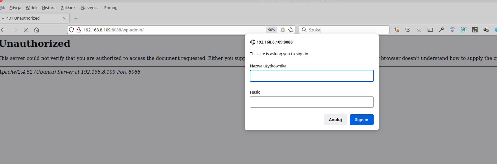

### Rozwiązanie zadania zabezpieczenia folderu /wp-admin przy użyciu basic_auth  (lvl 0)

#### Założenia:
- wordpress zainstalowany przy pomocy poradnika ze strony [Install and configure WordPress | Ubuntu](https://ubuntu.com/tutorials/install-and-configure-wordpress#1-overview)

Do uruchomienia tego modułu Apache potrzebujesz:
- program/poleceni `htpasswd`, które wygneruje plik z loginem i hasłem do sprawdzania przy próbie wejścia do chronionego 
katalogu (znajdziesz je w pakiecie `apache2-utils`)
- wygenerowanego pliku z hasłem
- zainstalowanego i odblokowanego modułu `basic_auth`
- skonfigurowany webserver tak, żeby korzystał z `basic_auth`


1) sprawdzamy czy mamy polecenie `htpasswd`:  
``which htpasswd``


U mnie jest, ale gdyyby nie było, to trzeba je zainstalować:   
``sudo apt install apache2-utils``


2) wygenerowanie pliku z hasłem.   
Plik z hasłem można trzymać w zasadzie w dowolnym miejscu, z którego użytkownik Apache (www-data) będzie mógł go odczytać.
Jeżeli nazwiesz plik zaczynająć od `.ht` to możesz go utworzyć nawet w folderze z plikami wordpressa bo w głównym 
konfigu Apache (`apache.conf`) jest odpowiednia dyrektywa, która nie pozwala na odczyt tych plików przez www. 
Mimo pewnej wygody w trzymaniu z hasłami razem z innymi plikami wordpressa polecałbym jednak umieścić go w bardziej
bezpiecznej lokalizacji - w katalogu domowym lub w folderze z konfiguracją apache (`/etc/apache2`)   
Tworzymy plik i dodajemy pierwszego użytkownika:   
``sudo htpasswd -c /home/jack/.htpasswd jack``   
to polecenie utworzy plik `/home/jack/.htpasswd` i doda tam wpis dla usera `jack`. Kolejnych userów dodajemy już bez 
flagi `-c`, która służy do stworzenia pliku. Inne często używane flagi to `-D` do usunięcia użytkownika czy `-v` 
do sprawdzenia, czy pamiętamy jeszcze dobre hasło.   
Zawartość pliku z hasłem:


3) moduł `basic_auth` jest instalowany domyślnie, ale czasami może być wyłączony. Żeby wylistować wszystkie włączone 
moduły Apache trzeba użyć polecenia `sudo apachectl -M`   
Przykładowy output w sytuacji, kiedy basic_auth jest wyłączony:


Żeby go teraz włączyć należy użyć: `sudo a2enmod auth_basic` a następnie zrestartować apache zgodnie z podpowiedzą:
`sudo systemctl restart apache2` 


4) Teraz musimy powiedzieć Apache który folder chcemy zabezpieczyć. W dokumentacji do tego modułu 
https://httpd.apache.org/docs/2.4/mod/mod_auth_basic.html odnajdujemy informację, jaki context może być użyty:


Oznacza to, że `basic_auth` możemy ustawić w pliku konfiguracyjnym virtaulhosta (`/etc/apache2/sites-enabled/wordpress.conf`)
albo możemy ustawiać go w pliku `.htaccess`. 

Obecna zawartość pliku `wordpress.conf`:
```
<VirtualHost *:80>
    DocumentRoot /srv/www/wordpress
    <Directory /srv/www/wordpress>
        Options FollowSymLinks
        AllowOverride Limit Options FileInfo
        DirectoryIndex index.php
        Require all granted
    </Directory>
    <Directory /srv/www/wordpress/wp-content>
        Options FollowSymLinks
        Require all granted
    </Directory>
</VirtualHost>
```

##### Rozwiązanie z użyciem `Directory` sprowadza się do dodania kolejnej dyrektywy do pliku konfiguracyjnego:
```
   <Directory /srv/www/wordpress/wp-admin>
    	AuthType Basic
        AuthName "Restricted Files"
        AuthBasicProvider file
        AuthUserFile "/home/jack/.htpasswd"
        Require user jack 
   </Directory>
```
`AuthName` to informacja, która będzie wyświetlona w okienku żądania hasła   
`AuthUserFile` - ścieżka do pliku, w którym są przechowywane hasła   
`Require user jack` - pozwoli na dostęp tylko temu konkretnemu użytkownikowi. Można zastąpić inną opcją: 
`Require valid-user`, która wpuści wszystkich użytkowników, którzy będą w pliku z hasłami i podadzą poprawne hasło.

Plusem i jednocześnie minusem tego rozwiązania jest konieczność reloadu configu Apache, do czego potrzebny będzie root/sudo:
``sudo systemctl reload apache2 ``


##### Rozwiązanie z użyciem `.htaccess`

W plikach `.htaccess` można zmieniać niektóre ustawienia, o są dozwolone w konfiguracji virutalhosta. Lista udostępnionych
"opcji" znajduje się w parametrze `AllowOverride` wewnątrz `Directory`. 

Folder, który chcemy zabezpieczyć to `/srv/www/wordpress/wp-admin` i pasuje on do pierwszej dyrektywy `Directory`, a 
wartość `AllowOverride` to: `Limit Options FileInfo`. Sprawdzamy jaką wartość przyjmuje `AllowOverride` dla opcji 
związanych z autoryzacją: https://httpd.apache.org/docs/2.4/mod/core.html#allowoverride


Dodajemy `AuthConfig` do `AllowOverride`:

```
<Directory /srv/www/wordpress>
        Options FollowSymLinks
        AllowOverride Limit Options FileInfo AuthConfig
        DirectoryIndex index.php
        Require all granted
</Directory>
```

> W przypadku problemów można to miejsce "wyelimitnować" pozwalając `.htaccess` zmieniać wszystko co jest 
możliwe do ustawiania przez ten plik. `AllowOverride All`

Zmiana konfiguracji wymaga reloadu serwera: ``sudo systemctl reload apache2``

Teraz możemy wejść do `/srv/www/wordpress/wp-admin`, utworzyć tam plik `.htaccess` i tam dodać odpowiednią konfigurację:

```
AuthType Basic
AuthName "Restricted Files"
AuthBasicProvider file
AuthUserFile "/home/jack/.htpasswd"
Require user jack 
```


Na koniec sprawdzamy, czy działa:



> BTW. pamiętaj, że to nasz bohater wyczytał sobie gdzieś na forum, że tak się zabezpiecza Wordpressa, żeby go nie
> skanowały boty. Osobiście uważam, że to nie do końca prawda, niemniej jednak w opisany sposób można zabezpieczyć 
> folder w Apache przy użyciu `basic_auth` 
> 
Słowa, że tak sie zabezpiecze wordpressa moża różnie zrozumieć - to co właśnie wykonaliśmy pozwala w jakiś sposób zabezpieczyć dostęp do ścieżek/adresów, z których logujemy się do panelu admina - a to jedna z wielu składowych, które mogą pomóc. Nie znam metody, żeby to obejść - ktoś zna? Mówię o httpsie oczywiście włączonym.
Sprawdźcie na swoich instancjach, czy zabezpieczyliście w ten sposób dostęp do /wp-login.php oraz /wp-admin. 
To w sumie mój pierwszy commit w życiu, ten komentarz hehe:)
