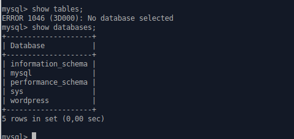
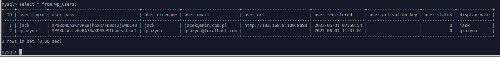

### Rozwiązanie zadania zmiany hasła w konsoli MySQL (lvl 0)

#### Założenia:
 - wordpress zainstalowany przy pomocy poradnika ze strony [Install and configure WordPress | Ubuntu](https://ubuntu.com/tutorials/install-and-configure-wordpress#1-overview)

> Zwróć uwagę, że w zadaniu trzeba zmienić hasło użytkownika wordpressa, a nie użytkownika bazy danych MySQL. 

zaloguj się na serwer i wejdź do bazy danych MySQL:

``sudo mysql -u root``

niestety standardowy znak zachęty nie daje info o aktywnej bazie danych co może powodować czasem problemy kiedy probujesz wykonac kod sql na nie tej bazie co chcesz
udało się zalogować do mysqla i wygląda to tak:

zobaczmy gdzie to nas polaczyło - np odpytując o tabele w bazie danych:
``show tables;``

``No database selected``- nie wybrano bazy. Dobra wylistujmy bazy danych:

``show databases;``

czyli nasza baza ma nazwę ``wordpress``. Przełączamy się tam używając 

``use wordpress;``

``Database changed`` - ale zwróć uwagę, ze prompt sie nie zmienia - dalej jest ``mysql>``  i na to trzeba uważać. Oczywiście można to sobie zmienić w konfiguracji, ale to nie czas na to. Wylistujmy tabele - znowu show tables;

ok. wyglada na to, że userzy będą w tabeli ``wp_users``. Wylistujmy jej zawartość:

``SELECT * FROM wp_users;``

jak widać hasła są w kolumnie ``user_pass`` i są zaszyfrowane.    

W jednym z kroków poradnika instalacyjnego była mowa o usuwaniu defaultowych linii z configu i wklejaniu nowych automatycznie wygenerowanych. 
Wsród tych linii była jedna, która odpowiada za sól - taki dodatkowy tekst doklejany do hasła, żeby trudniej było je łamać (w dość dużym uproszczeniu). 

Macie swojego usera ( tu ``jack``) i usera, który nie zna hasla (tu ``grazyna``).
W tym konkretnym wypadku można po prostu nadpisać wartość ``user_pass`` dla wiersza z danymi ``grazyna`` korzystajac ze znanego hasła usera ``jack``.
Dzięki temu będzie można się zalogować na konto grazyny uzywajac tego samego hasła ktore ma teraz ``jack``, ale uwaga - to zadziała w wordrpressie przy domyślnych ustawieniach i pewnie jeszcze wielu innych softach, ale na pewno nie we wszystkich.
Są takie "szyfratory", które wykorzystują nazwę usera do zbudowania hasha hasła i wtedy proste kopiowanie już nic nie da. Dobra  - działamy.

``update wp_users set user_pass = '$P$BqNUnJKrvRSWjh6xR/FD0oT2jwWDC40' where ID=2;``

sprawdźmy co jest teraz w tabeli: select * from wp_users;

Gra! Teraz szybko logujemy się na konto grazyny i już normalnie - z profilu użytkownika ustawiamy jej nowe hasło

na koniec sprawdzamy, czy w bazie jest widoczna ta zmiana - znowu ``select * from wp_users;``

hash hasła jest inny, więc wygląda, że wszystko ok